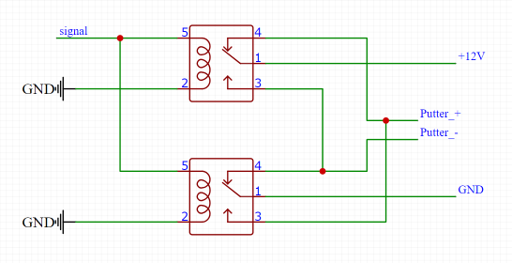
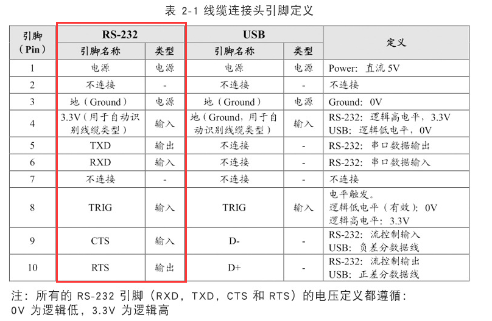

## 用到的外设

- `ADC1_IN4(PA4)`
- `UART5(PD2,PC12)`
- `USART1(PA9,PA10)`
- `USART2(PA2,PA3)`
- `USART3(PB10,PB11)`
- `USART6(PC6,PC7,PG8,PG13)`
- `GPIO(PB8,PC8,PE2,PA0,PB3,PB4,PB5)`

## 外接接口引脚

1. 温湿度传感器
   1. 485信号，5V供电，共计4Pin
   2. 485信号做板载转换器
2. 称重传感器
   1. 485信号2Pin，12V供电 2Pin
   2. 485信号做板载转换器
3. 推杆
   1. 继电器控制引脚PB8
   2. 做板载继电器模块，参考电路（12V改为24V）：
   
   3. Putter_+和Putter_-引出，2Pin
4. 烟雾传感器
   1. 使用ADC1_IN4(PA4)读取数据，5V供电，共计3Pin
5. 桶满传感器
   1. 桶满传感器即红外开关，一端接5V，一端接PE2，2Pin
6. 超声波传感器
   1. 串口使用UART5(PD2,PC12)
   2. 5V供电
   3. 共计4Pin
7. 扫码器
   1. RS23通信，使用USART6的RS232流控(PG8,PG13,PC6,PC7)
   2. 触发信号使用PC8
   3. 板载RS232接口，参考定义：
   
8. 按键
   1. 按键一端接VCC，另一端接PA0，共计2Pin
9. 上位机接口
    1. 与上位机通过485总线连接，2Pin
    2. 使用USART2(PA2,PA3)
    3. 做板载转换器